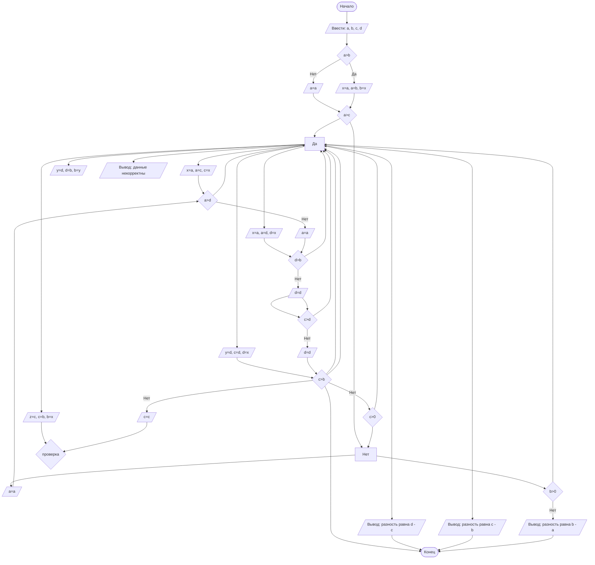

# lab.rabota.1
Шаломина Александра ПМ-2401. Вариант: 29
## Cодержание

1. [Отчет по лабораторной работе №](#отчет-по-лабораторной-работе--n)
2. [Критерии оценивания](#критерии-оценивания)

## Отчет по лабораторной работе № 1

#### № группы: `ПМ-2401`
#### Выполнил: `Шаломина Адександра Тимофеевна`
#### Вариант: `29`

### Cодержание:

- [Постановка задачи](#1-постановка-задачи)
- [Входные и выходные данные](#2-входные-и-выходные-данные)
- [Математическая модель](#25-математическая-модель)
- [Выбор структуры данных](#3-выбор-структуры-данных)
- [Алгоритм](#4-алгоритм)
- [Программа](#5-программа)
- [Анализ правильности решения](#6-анализ-правильности-решения)

### 1. Постановка задачи

- Условия задачи

> На вход программы подается четыре различных целых числа. Вывести на
экран разность максимального неположительного и минимального неотрицательного числа.

- Для решения задачи мне нужно найти наибольшее неположительное 
и наименьшее неотрицательное число. 
- Проанализировав задачу я поняла, что дле меня наиболее удобным и понятным путем будет являться 
ручная сортировка по возрастанию. 
- Для этого мне сначала надо сравнить переменную "а" со всеми остальными, если она окажется меньше какой-либо другой, то поменять их значения местами.
  (т.е если а больше b, то а не меняет своего значения, если наоборот, то теперь b хранит значение присвоенное изначально а, значение,присвоенное b. Такое же сравнение потом следует проделать с переменными с и d.
Важно, что если на этапе сравнения двух переменных какая-то из них оказывается больше чем а, тогда нам надо создать стороннюю переменную для а, после чего присвоить значение сторонней переменной той, которую мы сравниваем с а, т.к если писать а=b, а потом сразу b=a, то b присвоиться не значение а, а изначальное значение а,т.к операции выполняются последовательно.)
- После выполнения этой операции мы знаем, что а это наибольший элемент. 
- Далее можно начинать сравнивать d с остальными элементами, по аналогичному принципу, только проверять меньше ли d чем остальные элементы. 
- После сравнения d со всеми остальными, получается, что d это наименьший,введенный элемент. 
- Теперь, нужно проверить: что больше b или с. Если b больше, то оставить значения b и с как они есть, если нет - поменять их между собой.(тут тоже нужно ввести стороннюю переменную, при необходимости смены значений.) 
- Так как мы знаем, что по условию, все числа различны, и точно есть одно неотрицательное и одно неположительное число, мы можем проверить введеные данные на корректность.
- Если введенные данные корректны можно сравнить число с с 0, если оно больше или равно нуля, то оно и есть первое неотрицательное число, значит разность это d-c.
- Если с меньше нуля, то надо сравнить b с нулем,если b больше или равно нулю, то оно первое неотрицательное, тогда разность c-b.
- Если b меньше нуля, то первое неотрицательное а и разность : b-a.
- Можно заметить, не играет роли, при сравнение с нулем b и с строгость неравенства, т.к по условию значения введеных переменных не могут повторяться, поэтому при такой проверке ноль все равно будет учтен.(он будет либо первым неотрицательным или первым неположительным)

### 2. Входные и выходные данные
На вход программе подаются 4 целых различных числа, верхняя и нижняя границы не заданы, поэтому будем считать,что диапазон от минус бесконечности, до плюс бесконечности. 

|             | Тип          | min значение | max значение |
|-------------|--------------|--------------|--------------|
| a (Число 1) | Целое число  | -∞           | +∞           |
| b (Число 2) | Целое число  | -∞           | +∞           |
| c (Число 2) | Целое число  | -∞           | +∞           |
| d (Число 2) | Целое число  | -∞           | +∞            |

#### Данные на выход
на выход необходимо вывести разность наибольшего неположительного и наименьшего неотрицательного
т.к наибольшее неположительное это ноль, а наименьшее неотрицательное это один, а вычитается всегла из меньшего большее, то иожно сделать вывод, что максимальное значение, которое может получиться это -1, а далее при увеличении (по модулю) наибольшего и наименьшего разность будет уменьшаться.

|                    | Тип          | min значение | max значение |
|--------------------|--------------|--------------|--------------|
| Число 1 (разность) | Целое число  | -∞           | -1           |


### 2,5. Математическая модель

Если нужно.

### 3. Выбор структуры данных

Gрограмма получает на вход 4 целых различных числа. для их хранения можно выделить 4 переменные (`a`,`b`,`c`,`d`), типа `int`


|             | название переменной | Тип (в Java) | 
|-------------|---------------------|--------------|
| a (Число 1) | `a`                 | `int`        |
| b (Число 2) | `b`                 | `int`        | 
| c (Число 1) | `c`                 | `int`        |
| d (Число 1) | `d`                 | `int`        |

Для вывода результата необязательно его хранить в отдельной переменной.


### 4. Алгоритм

1. **Ввод данных:**  
   Программа считывает четыре целых числа, обозначенные как `a`,`b`,`c`,`d`.

2. **Сравнение чисел:**  
   1. Программа сравнивает значения `a` и `b`. Если `b` больше `a`, программа создает дополнительную переменную `x`, сохраняет туда изначальное значение `a`,присваивает для `b` изначальное значение `a`, а `a` присваивает значение `x`.
   Если `a` больше, программа оставляет для `a` исходное значение.
   2. Программа сравнивает значения `a` и `с`. Если `с` больше `a`, программа создает дополнительную переменную `x`, сохраняет туда изначальное значение `a`,присваивает для `с` изначальное значение `a`, а `a` присваивает значение `x`.
      Если `a` больше, программа оставляет для `a` исходное значение.
   3. Программа сравнивает значения `a` и `d`. Если `d` больше `a`, программа создает дополнительную переменную `x`, сохраняет туда изначальное значение `a`,присваивает для `d` изначальное значение `a`, а `a` присваивает значение `x`.
      Если `a` больше, программа оставляет для `a` исходное значение.
   4. Программа сравнивает значения `d` и `b`. Если `d` меньше `b`, программа создает дополнительную переменную `y`, сохраняет туда изначальное значение `d`,присваивает для `b` изначальное значение `d`, а `d` присваивает значение `y`.
         Если `d` меньше, программа оставляет для `d` исходное значение.
   5. Программа сравнивает значения `d` и `с`. Если `с` меньше `d`, программа создает дополнительную переменную `y`, сохраняет туда изначальное значение `d`,присваивает для `с` изначальное значение `d`, а `d` присваивает значение `y`.
      Если `d` меньше, программа оставляет для `d` исходное значение.
   6. Программа сравнивает значения `b` и `с`. Если `b` меньше `c`, программа создает дополнительную переменную `z`, сохраняет туда изначальное значение `b`,присваивает для `с` изначальное значение `b`, а `b` присваивает значение `z`.
         Если `c` меньше, программа оставляет для `c` исходное значение.

3. **Проверка данных на корректность:**
  - если (`a`<0 и `b`<0 и `c`<0 и `d`<0) или (`a`=`b` и `b`=`c` и `c`=`d`) или (`a`>0 и `b`>0 и `c`>0 и `d`>0), программа выводит на экран "данные не корректны"

4. **Вывод результата:**  
   0. если данные корректны, программа сравнивает `c` с нулём. 
   1. если `c`> 0, она выводит на экран "разность равна `d`-`c`".
   2. если `c`<0, она проверяет `b`> 0, если `b`> 0, она выводит на экран "разность равна `c`-`b`".
   3. если `b`<0, она выводит на экран "разность равна `b`-`a`".


```markdown
    ```mermaid
        V([Начало]) --> B[/Ввести: a, b, с, d/]
        B --> C{a>b}
        C -- Нет --> D[/a=a/]
        C -- Да --> E[/x=a, a=b, b=x/]
        D --> F{a>c}
        E --> F
        F --> Да --> K[/x=a, a=c, c=x/]
        F --> Нет --> L[/a=a/]
        K --> S{a>d}
        L--> S
        S --> Да --> M[/x=a, a=d, d=x/]
        S -- Нет --> N[/a=a/]
        M --> I{d>b}
        N --> I
        I --> Да --> Q[/y=d, d=b, b=y/]
        I -- Нет --> W[/d=d/]
        W --> R{c>d}
        W --> R
        R --> Да --> T[/y=d, c=d, d=x/]
        R -- Нет --> Y[/d=d/]
        T --> U{c>b}
        Y --> U
        U --> Да --> O[/z=c, c=b, b=x/]
        U -- Нет --> P[/c=c/]
        O --> A{"проверка"}
        P --> A
        U --> Да --> H[/Вывод: данные некорректны/]
        U -- Нет --> J{c>0}
        J --> Да --> Z[/Вывод: разность равна d - c/]
        J --> Нет --> c{b>0}
        c --> Да --> q[/Вывод: разность равна c - b/]
        c -- Нет --> e[/Вывод: разность равна b - a/]
        U --> y([Конец])
        Z --> y([Конец])
        q --> y([Конец])
        e --> y([Конец])
    ``` 
```




### 5. Программа

```java
import java.io.PrintStream;
import java.util.Scanner;
public class Main {
  public static Scanner in = new Scanner(System.in);
  // Объявляем объект класса Scanner для ввода данных
  public static PrintStream out = System.out;
  // Объявляем объект класса PrintStream для вывода данных
  public static void main(String[] args) {
      // считываем 4 целых числа
    int a = in.nextInt();
    int b = in.nextInt();
    int c = in.nextInt();
    int d = in.nextInt();
    // определяем максимальное число
    if (a < b) {
      int x = a;
      a = b;
      b = x;
    } else { a = a; }// сравниваем а и b, оставляем большее
    if (a < c) {
      int x = a;
      a = c;
      c = x;
    } else { a = a; }//сравниваем а и с, оставляем большее
    if (a < d) {
      int x = a;
      a = d;
      d = x;
    } else { a = a; }//сравниваем а и в, оставляем большее
    ////out.println(a);////
    // определяем минимальное число
    if (d > b) {
      int y = d;
      d = b;
      b=y;
    } else { d=d; }//сравниваем d и b, оставляем меньшее
    if (d > c) {
      int y = d;
      d = c;
      c=y;
    } else { d=d; }//сравниваем d и c, оставляем меньшее
    if (d > a) {
      int y = a;
      a = d;
      d=y;
    } else { d=d; }//сравниваем d и a, оставляем меньшее
    ////out.println(d);////
    if (c > b) {
      int z = c;
      c = b;
      b = z;
    } else { b = b;}//сравниваем с и b, оставляем большее
    if ((a<0 && b<0 && c<0 && d<0) || (a==b && b==c && c==d) || (a>0 && b>0 && c>0 && d>0))// проводим проверку данных {
      out.println("данные не корректны"); }
    else {
      if (c > 0) {
        out.printf("разность равна %d", (d - c));
      } else {
        if (b > 0) {
          out.printf("разность равна %d", (c - b));
        } else { out.printf("разность равна %d", (b - a));} } } // ищем числа больше и меньше нуля, записываем ответ
  }
}

```
### 6. Анализ правильности решения

1. Тест на ввод с нулем

- Input:
    ```
  0
  1
  4
  -5
    ```

- Output:
    ```
    разность равна -1
    ```

2. Тест на проверку общего случая

- Input:
    ```
    4
    5
    -6
    -9
    ```

- Output:
    ```
    разность равна -10
    ```

# Критерии оценивания

Обратите внимание на то, что лабораторная работа должна быть выложена в отдельный репозиторий с названием LabN (N -
Номер лабы). В репозитории должно быть минимум 2 файла (README.md - отчет, Main.java - код лабы)

| **Критерий**                                                                                                                                                                           | **Баллы**       |
|----------------------------------------------------------------------------------------------------------------------------------------------------------------------------------------|-----------------|
| **Корректность программы**                                                                                                                                                             | **0** - **40**  |
| - Программа полностью выполняет задачу                                                                                                                                                 | 15              |
| - Нет ошибок выполнения                                                                                                                                                                | 10              |
| - Учтены все ограничения                                                                                                                                                               | 5               |
| - Правильное поведение в "крайних" случаях                                                                                                                                             | 10              |
|                                                                                                                                                                                        |                 |
| **Оптимизация кода**                                                                                                                                                                   | **0** - **20**  |
| - Эффективные алгоритмы                                                                                                                                                                | 10              |
| - Избежание избыточности и повторов                                                                                                                                                    | 5               |
| - Разумность использования структур данных                                                                                                                                             | 5               |
|                                                                                                                                                                                        |                 |
| **Читабельность и стиль кода**                                                                                                                                                         | **0** - **20**  |
| - Соблюдение стандартов форматирования                                                                                                                                                 | 5               |
| - Наличие комментариев, в полном объеме поясняющих написанный код                                                                                                                      | 10              |
| - Понятные имена переменных и функций                                                                                                                                                  | 5               |
|                                                                                                                                                                                        |                 |
| **Оформление отчета**                                                                                                                                                                  | **0** - **20**  |
| - Соблюдение структуры отчета                                                                                                                                                          | 5               |
| - Отчет загружен на GitHub в репозиторий с названием LabN (N - номер лабораторной работы), отчет в формате Markdown с названием README.md, также есть файл Main.java с кодом программы | Обязательно     |
| - Четкое описание алгоритма (блок-схема если нужна)                                                                                                                                    | 5               |
| - Полнота покрытия тестами всех случаев                                                                                                                                                | 5               |
| - Обоснования использования алгоритма, структур данных                                                                                                                                 | 5               |
|                                                                                                                                                                                        |                 |
| **Общая сумма**                                                                                                                                                                        | **0** - **100** |


